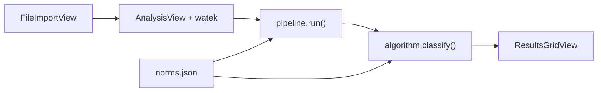

# Pipeline EEG i wyniki — Plan Brief

> Full plan: `context/changes/eeg-pipeline-and-results/plan.md`

## What & Why

Slice S-02 domyka rdzeń produktu: po metryce i imporcie pliku pedagog klika „Analizuj”, aplikacja lokalnie przetwarza sygnał EEG (MNE), porównuje 10 komórek z bazą norm i pokazuje siatkę RAG oraz jedną z trzech kategorii przesiewowych — bez surowych µV na ekranie. To warunek weryfikacji hipotezy produktu przed raportem PDF (S-03).

## Starting Point

F-01 dostarczył `types.py`, `norms.json` (10 norm, pasma, `recommendation_threshold`), loader `norms.py`. S-01 dostarczył `AppState` (metryka + `eeg_path`), `FileImportView` ze stubem `print("Analiza: gotowe do S-02")`, walidację nagłówka MNE w wątku. Brak `pipeline.py`, `algorithm.py`, widoków `analysis.py` / `results_grid.py`. W repozytorium nie ma pliku `.edf` — testy importu mockują MNE.

## Desired End State

Użytkownik z kompletną metryką i poprawnym plikiem `.edf`/`.vhdr` uruchamia analizę, widzi postęp (z możliwością anulowania), a po sukcesie — siatkę 10 kolorowych komórek, nazwę kategorii (Wskazanie / Uważna obserwacja / Brak wskazań) i opis słowny z `norms.json`. Błędy pipeline (brak segmentów, brak C3/O1 po aliasach, odrzucenie wszystkich epok) kończą się komunikatem po polsku i opcjonalnym zwiniętym panelem „Szczegóły” bez wartości µV. `pytest -q` i `mypy app/ --strict` przechodzą z testami syntetycznym MNE.

## Key Decisions Made

| Decision | Choice | Why (1 sentence) | Source |
| --- | --- | --- | --- |
| Artefakty | Notch + epoki + odrzucanie amplitudowe (MNE, bez pakietu `autoreject`) | Balans jakości i czasu; bez ICA/PyInstaller sklearn | Plan |
| Znaczniki OO/OZ/ZP | Kolejność OO→OZ→ZP + aliasy PL; fallback 3×3 min gdy brak znaczników; min. 8 min | `docs/EEG-segmentacja.md` |
| Amplituda komórki | Średnia \|x\| w µV po filtrze pasma | Zgodność z PRD „średnia amplituda” | Plan |
| Progi kategorii | 10/10 w kodzie; częściowe z `recommendation_rules` w norms.json | Ekspert stroi progi bez rebuildu; skrajne przypadki stałe | Plan |
| Granice kolorów | PRD (≤Z, ≥K) + tolerancja float | Uniknięcie 30.349999 vs 30.35 | Plan |
| Kanały C3/O1 | Faza 1: aliasy + fail-fast; Faza 4: picker (opóźniony) | Najpierw działający pipeline, potem UX ratunku | Plan |
| Opisy kategorii | `category_descriptions` w norms.json | Copy konfigurowalne jak normy Z/K | Plan |
| UI flow | AnalysisView → ResultsGridView | Spójne z wątkiem importu S-01 | Plan |
| Błędy | PL + zwinięte szczegóły bez µV | Wsparcie bez wycieku danych wrażliwych | Plan |
| Anulowanie | Flaga cooperative między krokami pipeline | Kontrola przy długich plikach | Plan |
| Testy | Syntetyczny Raw MNE w unit | CI bez binariów EEG | Plan |

## Scope

**In scope:**
- `app/domain/pipeline.py`, `app/domain/algorithm.py`, `app/domain/channels.py` (aliasy)
- Rozszerzenie `types.py`, `norms.py`, `norms.json` (`recommendation_rules`, `category_descriptions`)
- `app/ui/views/analysis.py`, `results_grid.py`, komponent siatki RAG
- Rozszerzenie `AppState`, podpięcie `NormsConfig` z `main.py`
- Faza 4: dialog mapowania kanałów (po działającym pipeline)
- Testy unit: algorithm, pipeline (syntetyczny), channels

**Out of scope:**
- PDF i zapis (S-03)
- Pełna dokumentacja/walidacja CLI dla nowych pól norms (S-04 — minimalna walidacja w S-02)
- Raport jakości artefaktów w UI (v2.0)
- Picker kanałów w Fazach 1–3 (tylko Faza 4)

## Architecture / Approach

Warstwa domenowa liczy `AnalysisResult`; UI nigdy nie wyświetla µV. Wyjątki `PipelineError` / `AnalysisCancelledError` tłumaczone na PL na granicy widoku.

## Phases at a Glance

| Phase | What it delivers | Key risk |
| --- | --- | --- |
| 1. Pipeline sygnału | 10 wartości µV wewnętrznie, segmentacja, notch, odrzucanie epok, aliasy kanałów | Czas analizy >10 min na dużych plikach; parametry reject |
| 2. Algorytm + norms | Kolory komórek, kategoria, nowy schemat JSON | Migracja `recommendation_threshold` → `recommendation_rules` |
| 3. UI analiza i wyniki | „Analizuj”, postęp, anuluj, siatka RAG | Race wątku CTk; brak µV w szczegółach błędu |
| 4. Picker kanałów | Mapowanie ręczne C3/O1 przed analizą | Błędny wybór użytkownika vs normy |

**Prerequisites:** S-01 ukończone (`metadata-and-import` archived), `norms.json` i typy z F-01  
**Estimated effort:** ~3–4 sesje implementacji, 4 fazy (ostatnia po manualnym QA Fazy 3)

## Open Risks & Assumptions

- Metoda `mean(abs)` musi być spójna z badaniem normatywnym — przy rozjazdach wyników ekspert może wymagać korekty formuły (poza MVP bez zmiany norm)
- Odrzucenie epok może opróżnić segment — wymaga czytelnego `PipelineError`
- `recommendation_threshold` w starych plikach norms: loader powinien obsłużyć migrację lub czytelny błąd
- Brak realnego `.edf` w CI — regresje na plikach placówek tylko manualnie

## Success Criteria (Summary)

- Pełny flow: metryka → import → Analizuj → siatka 10 kolorów + kategoria + opis (bez µV w UI)
- `python -m pytest -q` i `mypy app/ --strict` — green
- Analiza typowego pliku kończy się ≤10 min na PC biurowym (manual)
